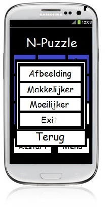

N-Puzzle Concept
==========


Classes and methods:
-------------
* SplashActivity
	* splashscreen
	* gaat over in StartActivity
* StartActivity 	
	* scherm met instellingen voor een nieuwe n-puzzle
	* heeft een horizontale gallery view van images die geselecteerd kunnen worden als puzzel
	* heeft een slider voor de moeilijkheidsgraad (1 tot 3)
	* heeft een button om het spel te starten met de aangewezen specificaties
	* specificaties worden meegegeven aan GameActivity
	* 
	

* GameActivity 	
	* bestaat uit een deel met n tiles (3x3 of 4x4 of 5x5)
	* in deze tiles is de afbeelding (opgebroken in n delen) te zien
	* de afgebroken afbeelding wordt voor 3 seconde correct getoond
	* daarna wordt er 1 tile verwijderd en worden de tiles met elkaar pseudo random gewisseld
	* heeft een button restart wat GameActivity opnieuw aanroept met de gekozen specificaties
	* heeft een button menu die gaat naar MenuActivity
	* 
	
	
* MenuActivity
	* geeft een popup over het scherm van GameActivity
	* in de popup zijn vier buttons
	* Button Afbeelding gaat naar de StartActivity en laat de gebruiker een nieuwe afbeelding kiezen
	* Button Makkelijker start een nieuw game met, indien mogelijk, de puzzel een niveau lager
	* Button Makkelijker start een nieuw game met, indien mogelijk, de puzzel een niveau hoger
	* Button Exit sluit het spel af
	* 
	
	
* EndofgameActivity 
	* Popup met tekst, knop gaat naar StartActivity
	* 


Databases:
-------------
*	State wordt opgeslagen in shared preferences.


Styleguide:
==========

Voor de programmeerstijl gebruik ik de Google Java Programming Guide, ook te vinden op https://google-styleguide.googlecode.com/svn/trunk/javaguide.html, met de volgende uitzonderingen:

Comments
-------------
Comments van één regel worden als volgt gedaan:
```
//dit is een comment
```
Comments van meerdere regels worden anders gedaan:
```
/*
 * Dit is een comment.
 * Met meerdere regels.
 */
```
Braces
-------------
Braces worden geopend op een new line en gesloten op een new line.
```
int voorbeeld(int a)
{
    return a;
}
```
